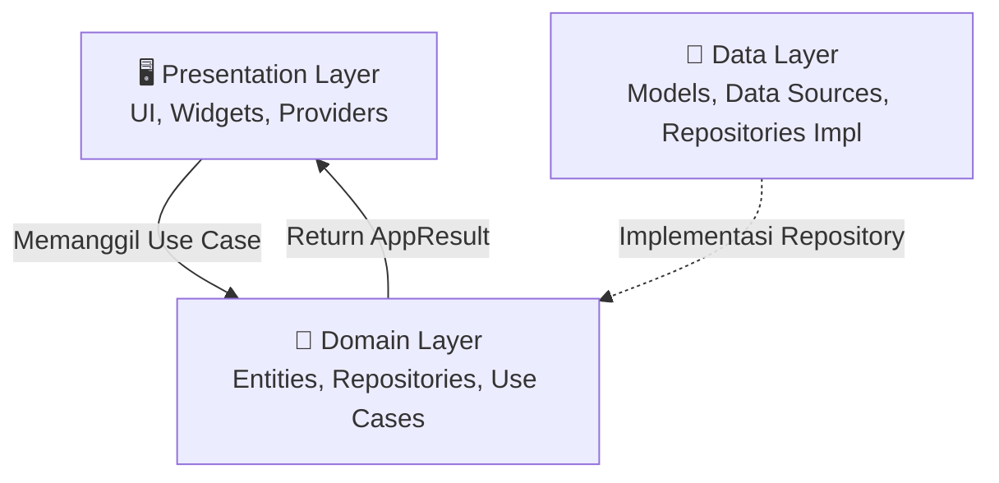

# 🏛️ Dokumentasi Arsitektur Sistem — HSIL Attendance (Absen!)

> **Versi**: 1.0.0  
> **Platform**: Mobile (Android)  
> **Backend**: Firebase Cloud Platform  
> **Pola Arsitektur**: Clean Architecture & Provider State Management

Dokumen ini menjelaskan arsitektur perangkat lunak (Software Architecture) dari sistem aplikasi absensi HSIL secara komprehensif, mencakup desain tingkat tinggi (High-Level Design), struktur direktori, hingga pengelolaan *state*.

---

## 1. High-Level System Architecture

Sistem ini menggunakan arsitektur **Serverless** berbasis Firebase. Aplikasi *client* berinteraksi secara langsung dengan layanan Firebase melalui Firebase SDK, dengan aturan keamanan yang diatur pada Firestore Security Rules. Logika bisnis kompleks yang membutuhkan isolasi atau hak akses admin dijalankan di backend (Cloud Functions).

```mermaid
graph TD
    Client[📱 Aplikasi Flutter (Android)]
    
    subgraph Firebase Cloud Platform
        Auth[Firebase Authentication]
        Firestore[(Cloud Firestore)]
        Storage[(Cloud Storage)]
        Functions[⚡ Cloud Functions v2]
        FCM[🔔 Firebase Cloud Messaging]
    end
    
    subgraph External Services
        MLKit[🧠 Google ML Kit Face Detection]
        Maps[🗺️ Google Maps / Geolocator]
        SMTP[📧 Gmail SMTP / Nodemailer]
    end

    Client <-->|Login, Reset Password| Auth
    Client <-->|CRUD Data, Real-time Sync| Firestore
    Client -->|Upload Selfie Izin/Absen| Storage
    Client -->|Panggil Fungsi Admin| Functions
    FCM -.->|Push Notifications| Client
    
    Functions -->|Update Status / Auto-Alpha| Firestore
    Functions -->|Kirim OTP| SMTP
    Functions -->|Trigger Broadcast| FCM
    
    Client -->|Validasi Jarak| Maps
    Client -->|Validasi Wajah| MLKit
```

---

## 2. Clean Architecture (Client Side)

Aplikasi Flutter ini dibangun menggunakan pola **Clean Architecture** yang ketat, membagi *codebase* menjadi 3 *layer* utama untuk mencapai *separation of concerns*, skalabilitas, dan kemudahan pengujian.



### 2.1 Domain Layer (Layer Inti / Paling Dalam)
Layer ini **tidak bergantung pada apa pun** (termasuk Flutter library sebisa mungkin, kecuali untuk *core utilities*).
- **Entities**: Objek bisnis murni (`AppUser`, `AttendanceRecord`, `LeaveRequest`).
- **Repositories (Interfaces)**: Kontrak/interface yang mendefinisikan apa yang bisa dilakukan sistem (contoh: `AttendanceRepository`, `AuthRepository`).
- **Use Cases**: Logika bisnis spesifik dari suatu fitur (contoh: `ClockInUseCase`, `ValidateGPSUseCase`, `ReviewLeaveUseCase`).

### 2.2 Data Layer (Layer Luar)
Bertanggung jawab untuk berkomunikasi dengan sumber data eksternal (API, Firebase, Local Storage).
- **Models**: Ekstensi dari *Entities* yang memiliki fungsi `fromJson` dan `toJson` (contoh: `UserModel`, `AttendanceModel`).
- **Data Sources**: Berinteraksi langsung dengan database atau *third-party service*.
  - *Remote*: `FirestoreUserDataSource`, `FirebaseAuthDataSource`.
  - *Local*: `LocalSessionDataSource` (SharedPreferences/SecureStorage).
  - *Device*: `GeolocatorDataSource`, `FaceDetectionDataSource`.
- **Repositories Implementation**: Implementasi konkret dari kontrak yang didefinisikan di Domain Layer. Mengolah data dari *Data Sources* dan mengonversinya menjadi `AppResult` untuk diserahkan ke *Use Case*.

### 2.3 Presentation Layer (Layer UI)
Bertanggung jawab menampilkan data ke pengguna dan menerima *input*.
- **Screens**: Halaman UI utama (`LoginScreen`, `DashboardScreen`, `AdminEmployeeList`).
- **Widgets**: Komponen UI yang dapat digunakan kembali (*reusable*).
- **Providers (State Management)**: Mengelola *state* UI dan memanggil *Use Case*.

---

## 3. Dependency Injection (DI)

Semua dependensi diatur (di-*wire*) secara terpusat pada file `lib/core/di/app_dependencies.dart` menggunakan konsep **Provider/MultiProvider**. Hal ini memastikan objek dibuat secara efisien (*lazy loading*) dan siklus hidupnya (*lifecycle*) terkelola dengan baik.

**Alur Injeksi (Top-Down):**
1. **Third-Party Services** (`FirebaseFirestore`, `FirebaseAuth`, `SharedPreferences`) diinisiasi di level tertinggi.
2. **Data Sources** di-inject dengan menerima *Third-Party Services*.
3. **Repositories** di-inject dengan menerima *Data Sources*.
4. **Use Cases** di-inject dengan menerima *Repositories*.
5. **Providers (ChangeNotifier)** di-inject dengan menerima *Use Cases*.

---

## 4. State Management & Error Handling

### 4.1 State Management (Provider)
Aplikasi menggunakan pola arsitektur **MVVM** (Model-View-ViewModel) ringan di mana `ChangeNotifier` bertindak sebagai *ViewModel*.

- Setiap layar atau fitur memiliki satu Provider utama (contoh: `AttendanceProvider`, `AuthProvider`).
- State memuat status *loading* (`isLoading`), status keberhasilan, dan pesan kesalahan.
- UI menggunakan `Consumer` atau `context.watch` untuk bereaksi terhadap perubahan data.

### 4.2 Error Handling Pattern (`AppResult`)
Untuk menghindari penggunaan `try-catch` yang berantakan di UI, sistem menggunakan pola *Result/Either* via *sealed class* `AppResult<T>`.

Semua error yang terjadi di *Data Source* ditangkap di *Repository Implementation*, di-map menjadi tipe `Failure` (contoh: `AuthFailure`, `NetworkFailure`), lalu dikembalikan sebagai `AppFailure`. Provider di UI hanya perlu melakukan *pattern matching*:

```dart
final result = await clockInUseCase(...);

result.when(
  success: (record) {
    // Tampilkan pesan sukses, navigasi
  },
  failure: (error) {
    // Tampilkan snackbar dengan error.message
  },
);
```

---

## 5. Keamanan Sistem (Security Architecture)

### 5.1 Role-Based Access Control (RBAC)
- **Employee**: Hanya bisa membaca datanya sendiri (`isOwner`) dan menulis absen atas namanya sendiri.
- **Admin**: Memiliki akses penuh (baca/tulis) ke semua koleksi (`users`, `attendance`, `leave_requests`), dan akses ke *Admin Dashboard*. Role admin didefinisikan dengan statis di UI, namun tetap divalidasi oleh Firestore Rules.

### 5.2 Firestore Security Rules
- Secara default akses ditutup (`allow read, write: if false;`).
- Validasi dilakukan pada token Auth (`request.auth.uid`).
- Dokumen kehadiran (`attendance`) **tidak pernah bisa dihapus** (`allow delete: if false`), bahkan oleh admin, untuk menjaga integritas data (Audit Trail).

### 5.3 Anti-Spoofing (Kecurangan Absen)
- **Location Spoofing**: Validasi GPS bersifat *real-time* saat *clock-in* dengan akurasi tinggi (via Geolocator). Validasi membandingkan posisi perangkat dengan titik koordinat statis pabrik (Telkom University) menggunakan perhitungan *Haversine*.
- **Face Spoofing**: Integrasi Google ML Kit memaksa user untuk menggunakan kamera depan (*live feed*), mendeteksi 1 wajah, memeriksa kejelasan (tidak blur), dan memastikan pencahayaan cukup sebelum mengizinkan tombol potret aktif.

---

## 6. Otomatisasi (Cloud Functions & Cron Jobs)

Aplikasi memiliki backend tak terlihat yang menangani otomatisasi:

1. **Scheduled Job (Cron)**: `markDailyAlpha` berjalan setiap hari Senin-Jumat pukul 23:50 WIB. Mengidentifikasi karyawan aktif yang belum absen dan tidak sedang cuti/izin, lalu otomatis membuat dokumen absensi berstatus `"alpha"`.
2. **Event-Driven Triggers**: 
   - `createClockInNotification`: Triggered ketika `attendance` ditambahkan.
   - `sendBroadcastNotification`: Triggered ketika `broadcast_messages` ditambahkan, meneruskan pesan ke layanan FCM.
   - `deleteEmployeeAuth`: Triggered ketika akun dihapus oleh admin dari Firestore, memastikan Firebase Auth juga ikut dihapus.
3. **Callable Functions**: 
   - Endpoint untuk registrasi admin-only (`createEmployeeProfile`).
   - Endpoint aman pengiriman OTP via NodeMailer (`requestPasswordReset`, `verifyOtpAndResetPassword`).

---

## 7. Direktori Proyek Utama (Folder Structure)

```
lib/
├── core/               # Konfigurasi, Tema, Utilitas, Konstanta
│   ├── constants/      # app_constants.dart
│   ├── di/             # app_dependencies.dart (Dependency Injection)
│   ├── errors/         # failure.dart, exceptions.dart
│   ├── network/        # connectivity_service.dart
│   ├── themes/         # app_colors.dart, app_theme.dart
│   └── utils/          # app_result.dart, haversine_util.dart
├── data/               # Layer Data
│   ├── datasources/    # Remote/Local sources (Firestore, LocalStorage)
│   ├── models/         # DTO / JSON Models
│   └── repositories/   # Implementasi interface domain
├── domain/             # Layer Domain
│   ├── entities/       # Objek bisnis
│   ├── repositories/   # Abstract Interfaces
│   └── usecases/       # Bisnis logic spesifik
├── presentation/       # Layer UI
│   ├── providers/      # ChangeNotifier (State management)
│   ├── screens/        # UI Pages
│   ├── widgets/        # Reusable UI components
│   └── app_router.dart # Konfigurasi rute (GoRouter / Navigator)
├── main.dart           # Entry point aplikasi
└── firebase_options.dart # Konfigurasi platform Firebase
```
