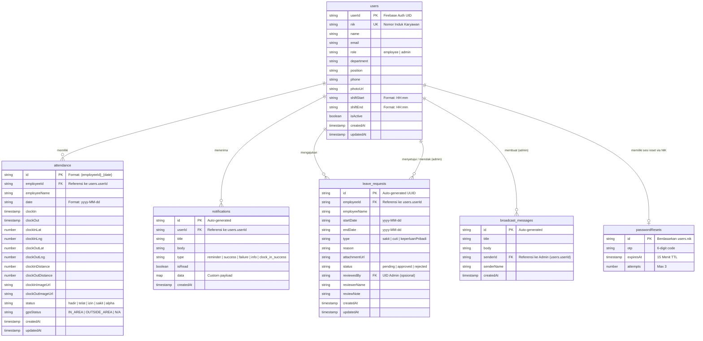

# 🗄️ Dokumentasi Entity-Relationship (ER) Diagram — HSIL Attendance

> **Versi**: 1.0.0  
> **Database**: Cloud Firestore (NoSQL)  
> **Format**: Mermaid.js (Diagram) & Deskripsi Lengkap

Meskipun Firebase Firestore adalah database NoSQL berbasis dokumen, dokumentasi ini memvisualisasikan relasi logis antar koleksi/dokumen menggunakan standar ER Diagram agar mudah dipahami secara arsitektural.

---

## 1. ER Diagram Visualisasi

Berikut adalah visualisasi ER Diagram dari sistem aplikasi absensi HSIL.

---

## 2. Penjelasan Relasi (Relationships)

Karena Firestore adalah database NoSQL, relasi (relationship) dibangun secara *logical* dengan menyimpan **ID Dokumen Referensi** (Foreign Key). 

### 2.1 `users` ↔ `attendance` (One-to-Many)
- **Kardinalitas:** 1 Karyawan memiliki banyak (N) record Kehadiran.
- **Implementasi:** Dokumen `attendance` menyimpan `employeeId` yang merujuk pada `users.userId`.
- **Primary Key (Attendance):** ID dokumen menggunakan format gabungan deterministik: `{employeeId}_{yyyy-MM-dd}` untuk memastikan hanya ada **1 dokumen per karyawan per hari**.

### 2.2 `users` ↔ `notifications` (One-to-Many)
- **Kardinalitas:** 1 Karyawan menerima banyak (N) Notifikasi.
- **Implementasi:** Dokumen `notifications` menyimpan `userId` yang merujuk pada `users.userId`. 
- Notifikasi di-*query* oleh aplikasi pengguna menggunakan `.where('userId', isEqualTo: currentUser.uid)`.

### 2.3 `users` ↔ `leave_requests` (One-to-Many / Employee)
- **Kardinalitas:** 1 Karyawan dapat mengajukan banyak (N) Permohonan Izin.
- **Implementasi:** `leave_requests` menyimpan `employeeId` untuk menghubungkan pengajuan dengan karyawan yang mengajukan.

### 2.4 `users` (Admin) ↔ `leave_requests` (One-to-Many / Reviewer)
- **Kardinalitas:** 1 Admin dapat mereview banyak (N) Permohonan Izin.
- **Implementasi:** Saat disetujui/ditolak, kolom `reviewedBy` pada `leave_requests` diisi dengan `userId` dari Admin yang mengeksekusi, bersamaan dengan `reviewerName`.

### 2.5 `users` (Admin) ↔ `broadcast_messages` (One-to-Many)
- **Kardinalitas:** 1 Admin dapat membuat banyak (N) Pengumuman Massal.
- **Implementasi:** Dokumen `broadcast_messages` menyimpan `senderId` dari Admin. Begitu dokumen ini dibuat, Cloud Functions (Trigger) akan menyebarkan pesannya ke FCM topic `"all_employees"`.

### 2.6 `users` ↔ `passwordResets` (One-to-One / Temporary)
- **Kardinalitas:** 1 Karyawan maksimal memiliki 1 sesi Reset Password aktif.
- **Implementasi:** Dokumen di koleksi `passwordResets` memiliki Document ID yang sama persis dengan `users.nik`. Relasi ini hanya bersifat sementara (TTL 15 menit) atau sampai batas percobaan habis (3 kali).

---

## 3. Strategi Pengindeksan (Composite Indexes)

Untuk mendukung relasi dan query yang cepat pada UI, database ini telah mengonfigurasi beberapa indeks majemuk (*Composite Indexes*):

1. **Query Kehadiran:**
   - `attendance` → `employeeId` (ASC) + `date` (DESC): Untuk melihat riwayat absensi terbaru per orang.
   - `attendance` → `status` (ASC) + `date` (DESC): Untuk filter daftar absen di menu history.
2. **Query Notifikasi:**
   - `notifications` → `userId` (ASC) + `createdAt` (DESC): Untuk memuat inbox notifikasi pengguna yang login secara kronologis.

---

## 4. Denormalisasi Data (NoSQL Pattern)

Pada beberapa koleksi, sistem celengan data ("*data redundancy*") diterapkan untuk mengurangi jumlah pembacaan dokumen (*read hits*). 

1. **`employeeName` di `attendance` & `leave_requests`:** Nama karyawan disalin (denormalized) langsung ke dokumen kehadiran dan perizinan. Hal ini mempermudah admin dalam membaca log pada tabel laporan tanpa perlu me-lookup/menggabungkan (*join*) dokumen ke koleksi `users`.
2. **`reviewerName` di `leave_requests`:** Nama admin disalin ketika izin direview.
3. **`senderName` di `broadcast_messages`:** Nama admin pengirim disalin untuk notifikasi FCM.
